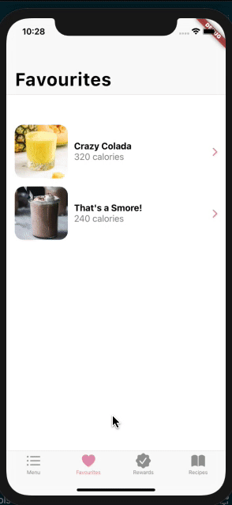
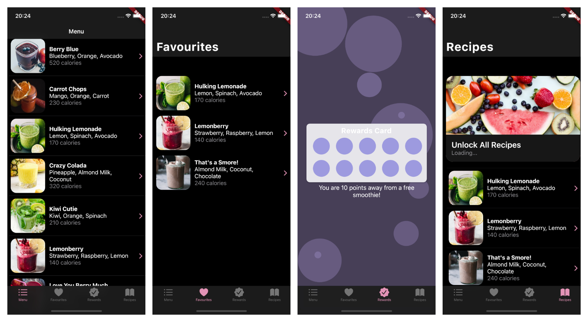
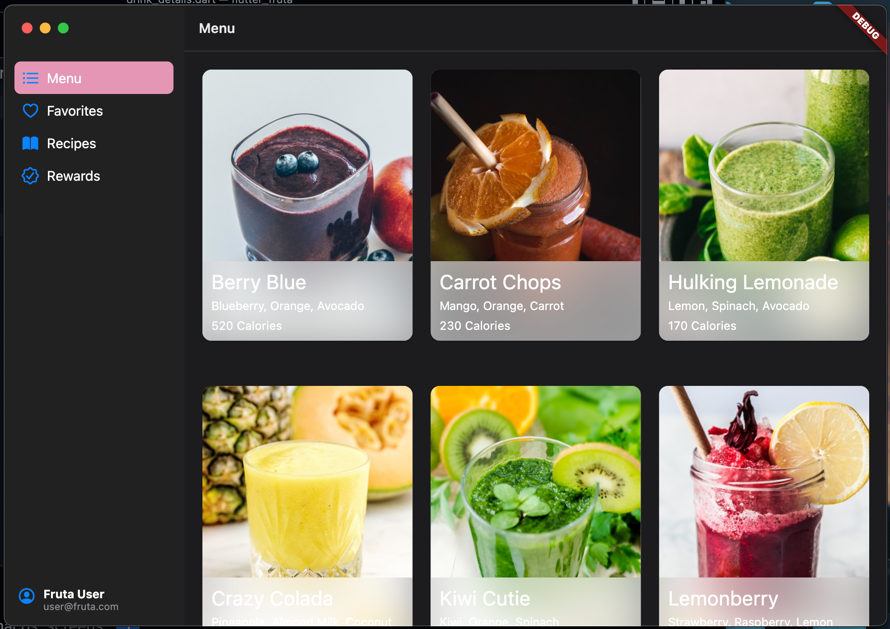

# Flutter Fruta

   	       

A Flutter project that attempts to recreate the SwiftUI 2020 sample project from WWDC 2020 using only Cupertino widgets.
The smoothie images used for this project are sourced from Unsplash and covered under the Unsplash Unsplash [License](https://unsplash.com/license). The images are acknowledged to their respective owners as covered in the [Acknowledgements.txt](https://github.com/TJMusiitwa/flutter_fruta/blob/main/Acknowledgments.txt) file.

## To-Do

 - [x] Fix Rewards Screen
 - [x] Make Proper the modal screen with iOS 13 likeness
 - [ ] Add Home widgets for iOS 14 support
 - [ ] Make an AppClip???

 ## Screenshots
| Home Screen                                                                                                  | Menu Details                                                                                                       |
| ------------------------------------------------------------------------------------------------------------ | ------------------------------------------------------------------------------------------------------------------ |
|  |  |

| Rewards Screen                                                                                                  | Recipes Screen                                                                                                  |
| --------------------------------------------------------------------------------------------------------------- | --------------------------------------------------------------------------------------------------------------- |
|  |  |

### Screen recording

### Dark mode Screenshots

### Desktop Screenshot

Done with Flutter for Desktop